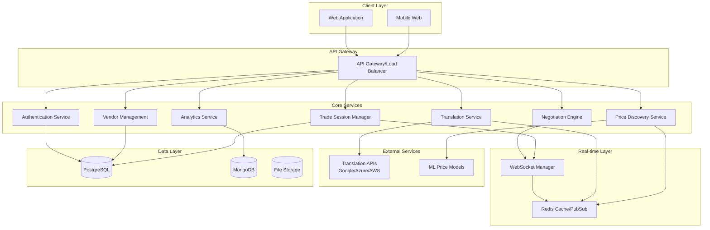

# Design Document: Multilingual Mandi Platform

## Overview

The Multilingual Mandi platform is a web-based real-time trading system that eliminates language barriers in local marketplaces through AI-powered translation, intelligent price discovery, and structured negotiation workflows. The platform enables seamless communication between vendors and customers speaking different languages while providing market-driven pricing insights and negotiation tools.

The system architecture follows a microservices pattern with real-time communication capabilities, leveraging cloud-based translation services, machine learning for price optimization, and WebSocket connections for instant messaging and negotiation flows.

## Architecture

### High-Level Architecture



### Technology Stack

**Frontend:**
- React.js with TypeScript for type safety and component reusability
- Material-UI or Tailwind CSS for responsive design
- Socket.IO client for real-time communication
- Progressive Web App (PWA) capabilities for mobile optimization

**Backend:**
- Node.js with Express.js for API services
- Socket.IO for WebSocket management and real-time communication
- Redis for caching, session management, and pub/sub messaging
- JWT for authentication and authorization

**Translation Services:**
- Primary: Google Cloud Translation API (Advanced) for context-aware translation
- Fallback: Azure Translator Text API for redundancy
- Custom terminology dictionaries for trade-specific vocabulary

**Machine Learning:**
- TensorFlow.js or Python-based ML models for price prediction
- Online learning algorithms for dynamic price adjustment
- Feature engineering based on product category, seasonality, and market trends

**Data Storage:**
- PostgreSQL for transactional data (users, vendors, trade sessions)
- MongoDB for analytics and unstructured data (market trends, user behavior)
- Redis for real-time data and caching
- AWS S3 or similar for file storage (product images, documents)

## Components and Interfaces

### Translation Engine

**Purpose:** Provides real-time, context-aware translation between supported language pairs with trade-specific terminology optimization.

**Key Components:**
- `TranslationService`: Core translation logic with API integration
- `ContextManager`: Maintains conversation context for accurate translations
- `TerminologyDictionary`: Trade-specific vocabulary and phrase mappings
- `LanguageDetector`: Automatic language identification for incoming messages
- `TranslationCache`: Redis-based caching for frequently translated phrases

**Interfaces:**
```typescript
interface TranslationRequest {
  text: string;
  sourceLang: string;
  targetLang: string;
  context?: ConversationContext;
  domain?: 'trade' | 'negotiation' | 'general';
}

interface TranslationResponse {
  translatedText: string;
  confidence: number;
  detectedLanguage?: string;
  alternatives?: string[];
  processingTime: number;
}

interface ConversationContext {
  sessionId: string;
  previousMessages: Message[];
  productCategory?: string;
  negotiationPhase?: 'inquiry' | 'negotiation' | 'closing';
}
```

### Price Discovery System

**Purpose:** Analyzes market data to provide intelligent pricing recommendations based on product characteristics, market conditions, and historical trends.

**Key Components:**
- `PriceAnalyzer`: Core pricing algorithm using machine learning models
- `MarketDataCollector`: Aggregates pricing data from various sources
- `SeasonalityEngine`: Handles seasonal price variations and trends
- `CompetitorMonitor`: Tracks competitor pricing for similar products
- `PriceRecommendationEngine`: Generates pricing suggestions with confidence intervals

**Interfaces:**
```typescript
interface PriceDiscoveryRequest {
  productId: string;
  category: string;
  attributes: ProductAttributes;
  vendorLocation: Location;
  marketConditions?: MarketConditions;
}

interface PriceRecommendation {
  suggestedPrice: number;
  priceRange: {
    min: number;
    max: number;
  };
  confidence: number;
  factors: PricingFactor[];
  marketPosition: 'below' | 'at' | 'above' | 'premium';
  lastUpdated: Date;
}

interface ProductAttributes {
  quality: 'basic' | 'standard' | 'premium';
  quantity: number;
  unit: string;
  seasonality?: 'high' | 'medium' | 'low';
  perishable: boolean;
}
```

### Negotiation Engine

**Purpose:** Facilitates structured price negotiations between vendors and customers with AI-powered suggestions and fairness indicators.

**Key Components:**
- `NegotiationManager`: Orchestrates negotiation workflows and rules
- `OfferValidator`: Validates offers against market data and business rules
- `FairnessAnalyzer`: Provides fairness indicators for both parties
- `CompromiseSuggester`: Suggests middle-ground solutions during impasses
- `NegotiationHistory`: Tracks negotiation patterns for learning

**Interfaces:**
```typescript
interface NegotiationSession {
  sessionId: string;
  vendorId: string;
  customerId: string;
  productId: string;
  initialPrice: number;
  currentOffer: number;
  counterOffer?: number;
  status: 'active' | 'paused' | 'completed' | 'cancelled';
  rounds: NegotiationRound[];
  timeLimit: Date;
}

interface NegotiationRound {
  roundNumber: number;
  offeredBy: 'vendor' | 'customer';
  amount: number;
  message?: string;
  fairnessScore: number;
  timestamp: Date;
}

interface FairnessIndicator {
  score: number; // 0-100
  factors: {
    marketComparison: number;
    historicalTrends: number;
    qualityAdjustment: number;
  };
  recommendation: 'accept' | 'counter' | 'reject';
}
```

### Trade Session Manager

**Purpose:** Manages complete trade interactions from initial contact through final transaction, maintaining state and history.

**Key Components:**
- `SessionOrchestrator`: Coordinates all aspects of a trade session
- `MessageManager`: Handles real-time messaging with translation
- `StateManager`: Maintains session state across different phases
- `DocumentGenerator`: Creates transaction summaries and agreements
- `DisputeHandler`: Manages dispute resolution workflows

**Interfaces:**
```typescript
interface TradeSession {
  sessionId: string;
  vendorId: string;
  customerId: string;
  productId: string;
  status: 'inquiry' | 'negotiating' | 'agreed' | 'completed' | 'disputed';
  messages: TranslatedMessage[];
  negotiation?: NegotiationSession;
  finalTerms?: AgreementTerms;
  createdAt: Date;
  updatedAt: Date;
}

interface TranslatedMessage {
  messageId: string;
  senderId: string;
  originalText: string;
  originalLanguage: string;
  translations: Map<string, string>;
  timestamp: Date;
  messageType: 'text' | 'offer' | 'system';
}

interface AgreementTerms {
  finalPrice: number;
  quantity: number;
  deliveryTerms: string;
  paymentMethod: string;
  agreedAt: Date;
  vendorSignature: string;
  customerSignature: string;
}
```

### Real-time Communication Layer

**Purpose:** Enables instant bidirectional communication between users with automatic translation and session management.

**Key Components:**
- `WebSocketManager`: Manages WebSocket connections and routing
- `MessageBroker`: Handles message queuing and delivery
- `PresenceManager`: Tracks user online status and availability
- `NotificationService`: Sends real-time notifications and alerts
- `ConnectionPool`: Manages connection scaling and load balancing

**Interfaces:**
```typescript
interface WebSocketMessage {
  type: 'message' | 'offer' | 'system' | 'notification';
  sessionId: string;
  senderId: string;
  recipientId: string;
  payload: any;
  timestamp: Date;
  requiresTranslation: boolean;
}

interface UserPresence {
  userId: string;
  status: 'online' | 'away' | 'offline';
  lastSeen: Date;
  activeSessionIds: string[];
  preferredLanguage: string;
}
```

## Data Models

### User and Vendor Models

```typescript
interface User {
  userId: string;
  email: string;
  phoneNumber?: string;
  preferredLanguage: string;
  supportedLanguages: string[];
  location: Location;
  profile: UserProfile;
  createdAt: Date;
  lastActive: Date;
  verified: boolean;
}

interface Vendor extends User {
  businessName: string;
  businessType: string;
  products: Product[];
  ratings: VendorRating[];
  averageRating: number;
  totalTransactions: number;
  responseTime: number; // average in minutes
  businessHours: BusinessHours;
  paymentMethods: string[];
}

interface Product {
  productId: string;
  vendorId: string;
  name: string;
  description: string;
  category: string;
  basePrice: number;
  currency: string;
  attributes: ProductAttributes;
  images: string[];
  availability: 'available' | 'limited' | 'out_of_stock';
  lastUpdated: Date;
}
```

### Transaction and Analytics Models

```typescript
interface Transaction {
  transactionId: string;
  sessionId: string;
  vendorId: string;
  customerId: string;
  productId: string;
  finalPrice: number;
  originalPrice: number;
  negotiationRounds: number;
  currency: string;
  status: 'pending' | 'completed' | 'cancelled' | 'disputed';
  completedAt?: Date;
  paymentMethod: string;
  deliveryStatus: string;
}

interface MarketAnalytics {
  productCategory: string;
  region: string;
  averagePrice: number;
  priceRange: { min: number; max: number };
  transactionVolume: number;
  seasonalTrends: SeasonalData[];
  competitorCount: number;
  demandLevel: 'low' | 'medium' | 'high';
  lastUpdated: Date;
}

interface UserBehaviorAnalytics {
  userId: string;
  sessionDuration: number;
  messagesPerSession: number;
  negotiationSuccessRate: number;
  preferredCategories: string[];
  averageTransactionValue: number;
  languageUsagePatterns: Map<string, number>;
}
```

## Correctness Properties

*A property is a characteristic or behavior that should hold true across all valid executions of a system—essentially, a formal statement about what the system should do. Properties serve as the bridge between human-readable specifications and machine-verifiable correctness guarantees.*

Before defining the correctness properties, I need to analyze the acceptance criteria from the requirements to determine which ones are testable as properties.

### Translation Correctness Properties

**Property 1: Translation Performance and Accuracy**
*For any* valid message in a supported source language, the Translation_Engine should produce a translated result in the target language within 2 seconds with preserved numerical data and trade-specific terminology
**Validates: Requirements 1.1, 1.2, 1.5**

**Property 2: Translation Error Handling**
*For any* translation request that cannot be completed due to service failures or invalid inputs, the Translation_Engine should notify both parties and provide alternative communication suggestions
**Validates: Requirements 1.3**

**Property 3: Language Support Coverage**
*For any* message in the 10 supported regional languages, the Translation_Engine should successfully process and translate the content to any other supported language
**Validates: Requirements 1.4**

### Price Discovery Properties

**Property 4: Price Recommendation Generation**
*For any* product listing with valid attributes, the Price_Discovery_System should generate price recommendations within 5 seconds that include ranges rather than fixed prices and consider all specified market factors
**Validates: Requirements 2.1, 2.3, 2.5**

**Property 5: Market Responsiveness**
*For any* change in market conditions, the Price_Discovery_System should update affected price recommendations and notify relevant vendors
**Validates: Requirements 2.2**

**Property 6: Data Insufficiency Handling**
*For any* product with insufficient market data, the Price_Discovery_System should indicate uncertainty levels and suggest data collection strategies
**Validates: Requirements 2.4**

### Negotiation Engine Properties

**Property 7: Negotiation Session Initialization**
*For any* new negotiation, the Negotiation_Engine should establish clear rules, time limits, and validation criteria for the negotiation process
**Validates: Requirements 3.1**

**Property 8: Offer Validation and Fairness**
*For any* offer made during negotiation, the Negotiation_Engine should validate it against market data and provide fairness indicators to both parties
**Validates: Requirements 3.2**

**Property 9: Negotiation Resolution**
*For any* completed negotiation, the Negotiation_Engine should generate agreement summaries in both parties' languages and provide compromise suggestions for impasses
**Validates: Requirements 3.3, 3.5**

**Property 10: Negotiation Learning**
*For any* completed negotiation, the Negotiation_Engine should store the interaction data and generate insights for improving future negotiations
**Validates: Requirements 3.4**

### Search and Discovery Properties

**Property 11: Vendor Search and Ranking**
*For any* product search query, the Mandi_Platform should return relevant local vendors ranked by proximity, price, and ratings with proper filtering capabilities
**Validates: Requirements 4.1, 4.3**

**Property 12: Vendor Information Localization**
*For any* vendor information display, the Mandi_Platform should show translated descriptions, localized prices, availability status, and verification information in the customer's preferred language
**Validates: Requirements 4.2, 4.5**

**Property 13: Real-time Inventory Synchronization**
*For any* vendor inventory update, the Mandi_Platform should reflect the changes in search results within 1 minute
**Validates: Requirements 4.4**

### Trade Session Management Properties

**Property 14: Session Lifecycle Management**
*For any* customer-vendor interaction, the Mandi_Platform should create unique Trade_Sessions, maintain chronological message history with translations, and record final agreements in both languages
**Validates: Requirements 5.1, 5.2, 5.3**

**Property 15: Session Analytics and Dispute Handling**
*For any* Trade_Session, the Mandi_Platform should provide historical insights for users and mediation tools for disputes
**Validates: Requirements 5.4, 5.5**

### Analytics and Insights Properties

**Property 16: Privacy-Preserving Analytics**
*For any* transaction data collection and analysis, the Mandi_Platform should generate market insights while preserving individual user privacy
**Validates: Requirements 6.1**

**Property 17: Market Report Generation**
*For any* market report request, the Mandi_Platform should provide trend analysis including product categories, pricing patterns, and seasonal variations
**Validates: Requirements 6.2**

**Property 18: Personalized Recommendations**
*For any* vendor, the Mandi_Platform should generate personalized recommendations based on their transaction history and market performance
**Validates: Requirements 6.3**

**Property 19: Localized Analytics Display**
*For any* analytics display, the Mandi_Platform should present information in the user's preferred language with culturally appropriate visualizations and export capabilities
**Validates: Requirements 6.4, 6.5**

### Security and Trust Properties

**Property 20: Communication Security**
*For any* communication between users, the Mandi_Platform should implement end-to-end encryption and maintain audit logs while protecting user privacy
**Validates: Requirements 7.1, 7.5**

**Property 21: Authentication and Fraud Detection**
*For any* user registration, the Mandi_Platform should verify identity through multiple authentication methods and monitor for suspicious transaction patterns
**Validates: Requirements 7.2, 7.3**

**Property 22: Data Protection Compliance**
*For any* user data storage and processing, the Mandi_Platform should comply with local data protection regulations and provide clear privacy controls
**Validates: Requirements 7.4**

### Platform Interface Properties

**Property 23: Responsive Design Compatibility**
*For any* screen size from 320px to 1920px width, the Mandi_Platform should provide a fully functional interface with optimized touch interactions and feature parity across desktop and mobile
**Validates: Requirements 8.1, 8.2, 8.3**

**Property 24: Performance and Offline Capabilities**
*For any* network condition, the Mandi_Platform should load initial content within 3 seconds on standard connections and provide offline access to recent conversations and listings during poor connectivity
**Validates: Requirements 8.4, 8.5**

## Error Handling

### Translation Service Error Handling

**Service Unavailability:**
- Implement circuit breaker pattern for translation API calls
- Fallback to secondary translation service (Azure Translator if Google fails)
- Cache recent translations for offline access
- Provide manual translation request queuing during outages

**Translation Quality Issues:**
- Confidence scoring for all translations with user feedback mechanisms
- Manual review flagging for critical business communications
- Context preservation across conversation threads
- Terminology validation against trade-specific dictionaries

**Language Detection Failures:**
- Manual language selection fallback
- User preference learning from interaction patterns
- Multi-language support in single messages
- Character encoding validation and normalization

### Price Discovery Error Handling

**Insufficient Market Data:**
- Confidence intervals for price recommendations
- Data collection suggestions for vendors
- Historical trend extrapolation when current data is limited
- Regional market expansion for broader data sets

**Model Prediction Failures:**
- Fallback to rule-based pricing when ML models fail
- Manual price override capabilities for vendors
- Price validation against business logic constraints
- Market anomaly detection and alerting

**Real-time Data Synchronization Issues:**
- Event sourcing for price update tracking
- Conflict resolution for concurrent price changes
- Batch processing fallback for real-time failures
- Data consistency validation across services

### Negotiation Engine Error Handling

**Session State Corruption:**
- State recovery from event logs
- Checkpoint creation at negotiation milestones
- Manual intervention tools for administrators
- Session timeout and cleanup procedures

**Fairness Calculation Errors:**
- Multiple fairness algorithm implementations
- Manual fairness override for edge cases
- Historical fairness data validation
- Bias detection and correction mechanisms

**Communication Failures:**
- Message delivery confirmation and retry logic
- Offline message queuing and synchronization
- Connection state management and recovery
- Duplicate message detection and handling

## Testing Strategy

### Dual Testing Approach

The Multilingual Mandi platform requires comprehensive testing through both unit tests and property-based tests to ensure correctness across the complex multilingual and real-time systems.

**Unit Tests:**
- Focus on specific examples and edge cases for each component
- Test integration points between translation, pricing, and negotiation services
- Validate error conditions and recovery mechanisms
- Test specific language pairs and cultural localization scenarios
- Verify security implementations and data protection compliance

**Property-Based Tests:**
- Verify universal properties across all supported languages and market conditions
- Test system behavior with randomly generated product data, user interactions, and market scenarios
- Validate performance requirements under various load conditions
- Ensure data consistency across distributed services
- Test real-time communication reliability and message ordering

### Property-Based Testing Configuration

**Testing Framework:** 
- JavaScript/TypeScript: fast-check for property-based testing
- Integration with Jest for unit testing framework
- Custom generators for domain-specific data (products, languages, market conditions)

**Test Configuration:**
- Minimum 100 iterations per property test to ensure statistical significance
- Each property test tagged with format: **Feature: multilingual-mandi, Property {number}: {property_text}**
- Parallel test execution for performance validation
- Continuous integration with automated test runs on code changes

**Domain-Specific Generators:**
- Language pair generators for translation testing
- Product attribute generators for pricing algorithm testing
- Market condition generators for price discovery validation
- User interaction generators for negotiation workflow testing
- Network condition simulators for real-time communication testing

### Integration Testing Strategy

**Service Integration:**
- End-to-end workflow testing from product search to completed transaction
- Cross-service communication validation (translation ↔ negotiation ↔ pricing)
- External API integration testing with mock services for reliability
- Database consistency testing across PostgreSQL and MongoDB

**Real-time Communication Testing:**
- WebSocket connection management and failover testing
- Message ordering and delivery guarantee validation
- Concurrent user session testing with load simulation
- Translation accuracy testing in real-time conversation flows

**Performance Testing:**
- Load testing for concurrent translation requests
- Stress testing for price discovery under high market volatility
- Scalability testing for increasing user base and transaction volume
- Mobile performance testing across different device capabilities and network conditions

Each correctness property from the design document must be implemented as a single property-based test with appropriate tagging and minimum 100 iterations to ensure comprehensive validation of the system's multilingual trading capabilities.